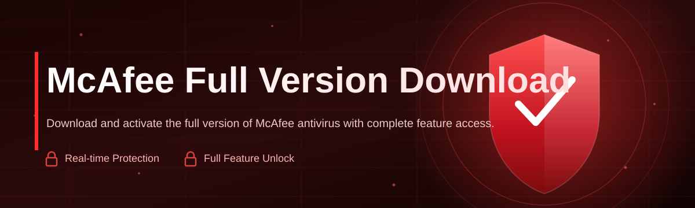

# mcafee-full-version-manager 🛡️⚡

  

*A single, dependable console for organizing your McAfee full version download, licensing state, and update lifecycle — built for people who want security tooling to just work.*

  

---

### 🚀 Quick Start

1. Visit the landing page below and grab the latest signed build for your Windows edition.

2. Run the standalone executable — no installer wizard, no bundled toolbars, no dependency chasing.

3. Point the manager at your existing McAfee installation (or a fresh one) and let it map your version, license, and update channel in seconds.

> [!TIP]
> First-time users should keep the app running during the initial scan — it builds a local inventory of components that every later action depends on.

## 🌐 Overview

`mcafee-full-version-manager` exists because security software has quietly become one of the most confusing corners of the Windows ecosystem. Version sprawl, half-finished uninstalls, mismatched license states, and update channels that silently drift out of sync — these are the everyday friction points for anyone trying to keep McAfee running cleanly. This project was built as an answer to that friction: a focused, no-nonsense manager that gives you visibility and control over your McAfee full version download, installation footprint, and renewal status without requiring you to dig through nested settings menus or guess which build you're actually running.

This tool is aimed at IT administrators managing fleets of endpoints, power users who like their security stack transparent and auditable, and everyday Windows users who just want a straight answer to "am I on the current, fully licensed version?" Rather than replacing McAfee's own product suite, this manager sits alongside it as a companion — surfacing version metadata, validating installation integrity, and streamlining the process of moving from a trial or partial install to the complete, fully-featured release.

Under the hood, the philosophy is simple: reliability over cleverness. Every workflow here is designed to be predictable, reversible, and boring in the best possible way — because when the subject is endpoint security, "boring and correct" beats "flashy and fragile" every time.

## 🔥 What Makes This Different

- **Unified version radar** — instead of hunting through multiple McAfee dashboards, the manager consolidates your installed edition, build number, and license tier into a single readable panel.

- **Guided full-version transition** — walks you step-by-step from a limited or trial McAfee setup toward a complete, fully licensed installation, flagging anything that could interrupt the process.

- **Integrity verification pass** — cross-checks installed components against expected manifests so partial or corrupted installs get caught before they cause runtime issues.

- **Silent update watchdog** — quietly monitors your update channel in the background and tells you the moment a newer definition set or full version release is available.

- **Clean rollback checkpoints** — before any major change, a restore point is snapshotted automatically, so you're never one bad update away from a support ticket.

- **Zero-noise interface** — a deliberately minimal UI that shows exactly what matters: status, version, and action — nothing performative, nothing cluttered.

- **Offline-friendly diagnostics** — the core inventory and health-check tools work without a constant internet connection, syncing details once you're back online.

- **Portable-first design** — the entire manager runs as a standalone executable, making it easy to carry on a technician's USB toolkit across multiple machines.

<strong>📋 Full Capability Matrix</strong>

| Capability | Description |
|---|---|
| Version Detection | Identifies installed McAfee edition, build, and license tier automatically |
| Full Version Guidance | Step-by-step path from trial/partial to complete installation |
| Integrity Checks | Validates component manifests against expected baselines |
| Update Monitoring | Background watchdog for definitions and full-version releases |
| Restore Checkpoints | Automatic snapshot before any structural change |
| Portable Mode | Runs standalone, no system-wide install required |
| Multi-Machine Support | Manage inventory across several endpoints from exported logs |
| Theme Support | Light, dark, and high-contrast interface modes |

## 🧭 Getting Started, Step by Step

<strong>Click to expand the full walkthrough</strong>

1. **Visit the landing page.** Use the download button in this README — it is the only distribution point for this project.

2. **Download the build matching your Windows edition.** The manager auto-detects 32-bit vs 64-bit environments, but the landing page also lists both explicitly.

3. **Run the executable.** No installer, no background services added to your system — it launches directly into the inventory scan.

4. **Review your version report.** Within moments you'll see your current McAfee edition, license status, and whether a full version upgrade path is recommended.

> [!NOTE]
> The manager does not modify McAfee's licensing servers or authentication systems — it reads local installation metadata and guides you through official upgrade and update pathways.

## 💻 System Requirements

| Requirement | Minimum |
|---|---|
| OS | Windows 10 (64-bit) or Windows 11 |
| RAM | 4 GB |
| Disk Space | 250 MB free |
| Dependencies | None — fully standalone |
| Admin Rights | Recommended for full integrity scans |

  

## ⚙️ How It Works

The manager operates as a lightweight pipeline: it scans, compares, reports, and guides — never acting on your system without a clear checkpoint in between.

1. **Discovery** — the tool scans installed McAfee components and registry markers to build a local inventory.

2. **Comparison** — that inventory is checked against known-good manifests for your detected edition and license tier.

3. **Reporting** — a plain-language status report surfaces version, integrity, and update state.

4. **Guided action** — if a full version upgrade or repair is warranted, the manager presents a step-by-step path with a checkpoint before execution.

5. **Verification** — after any change, a follow-up scan confirms the new state matches expectations.

## 🧩 Troubleshooting & Common Questions

<strong>Expand for real-world Q&A</strong>

**Q: The manager says my installation is "partial" — what does that mean?**
A: It means some expected McAfee components weren't found or don't match the manifest for your detected edition. Running the guided full-version path usually resolves this.

**Q: Can I run this alongside my existing McAfee subscription?**
A: Yes — the manager reads local metadata and does not interfere with your active subscription or license validation.

**Q: My update watchdog shows a stale timestamp. Is that a bug?**
A: Usually it means the background check hasn't run since your last reboot. Reopen the manager to force a fresh sync.

**Q: I restored a checkpoint but McAfee still shows the old version number.**
A: Restart the McAfee service (or reboot) after any checkpoint restore — version caches don't always refresh live.

**Q: Does this work on a machine with no internet connection?**
A: Core scanning and integrity checks work fully offline. Update detection requires connectivity to confirm the latest release.

**Q: Why does the tool ask for admin rights sometimes?**
A: Full integrity scans need elevated access to read certain protected installation directories accurately.

> [!WARNING]
> Always let a checkpoint restore finish completely before closing the application. Interrupting mid-restore can leave McAfee components in a mismatched state.

## 🎨 Interface, Shortcuts & Personalization

<strong>UI details</strong>

- **Themes:** Light, Dark, and High-Contrast — switchable from the settings gear without restarting the app.

- **Keyboard shortcuts:**
  - `Ctrl + R` — Re-run full inventory scan
  - `Ctrl + U` — Check for updates now
  - `Ctrl + Shift + C` — Create manual checkpoint
  - `Ctrl + L` — Open activity log
  - `Esc` — Cancel any in-progress action safely

- **Settings panel:** Configure scan frequency, checkpoint retention limits, and notification verbosity.

- **Status colors:** Green (fully licensed & current), Amber (update available), Red (integrity issue detected).

> [!IMPORTANT]
> Notification verbosity defaults to "essential only." Increase it in Settings if you're managing multiple endpoints and need every event logged.

## 🤝 Contributing & Community

Contributions are welcome from anyone who cares about clean, predictable security tooling. Whether it's refining detection logic, improving the guided upgrade flow, or polishing UI copy, please open an issue first to discuss scope before submitting a pull request.

- Report bugs with clear reproduction steps and your Windows build number.

- Suggest features through the Discussions tab — roadmap decisions are made openly.

- Star the repository if this tool saves you time — it genuinely helps visibility and continued maintenance.

> [!NOTE]
> This project is community-maintained. Response times vary, but every issue is read and triaged.

## 📄 License

Released under the [MIT License](LICENSE), 2026. Use it, adapt it, redistribute it — just keep the license notice intact.

## ⚖️ Disclaimer

`mcafee-full-version-manager` is an independent, community-built companion tool and is not affiliated with, endorsed by, or officially connected to McAfee, LLC or its parent company. "McAfee" is a trademark of its respective owner, referenced here solely for descriptive and interoperability purposes. This tool reads local installation metadata to assist users in managing their own legitimately licensed McAfee software; it does not generate, distribute, or circumvent licenses in any form. Users are responsible for ensuring their McAfee subscription and licensing status comply with the vendor's terms of service.

---

